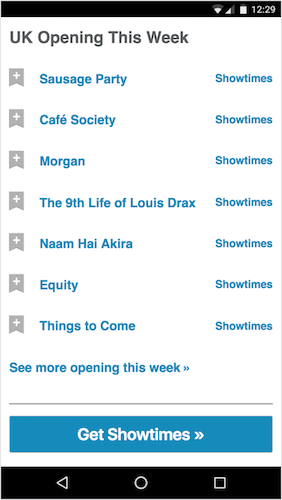

# IMDB PWA APP IN REACT    
  

## Baby steps into React    
This project was my first steps using React at Codeclan.

## Specification    

Here's a component from IMDB showing opening movies this week.    
    

Draw out the skeleton of this app on paper.
Write down the names of the components and whether they have state or props.
For example:    

CommentBox - State:comments
.. CommentList Props:comments
... Comment Props:comment
... Comment Props:comment
... Comment Props:comment
.. CommentForm State:author, text Props:handleCommentSubmit(function)    

Once you've sketched this out, implement the IMDB component in React.
